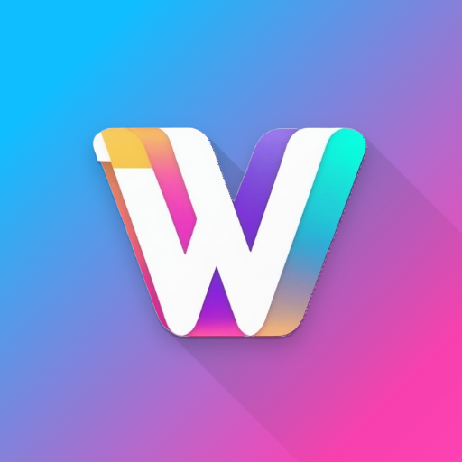
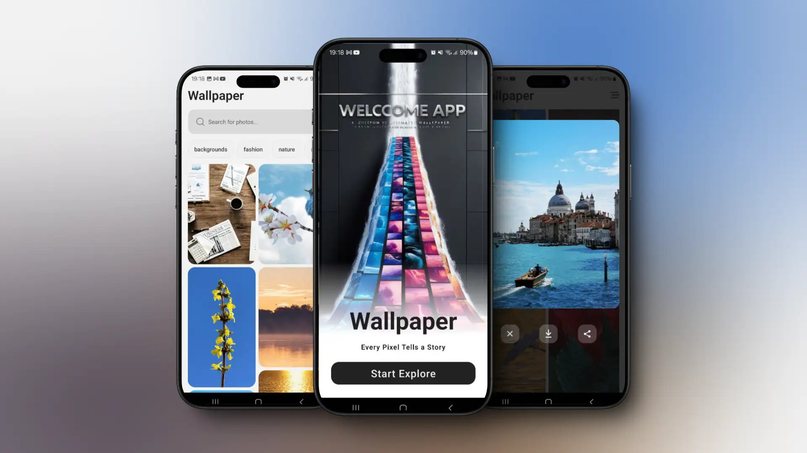
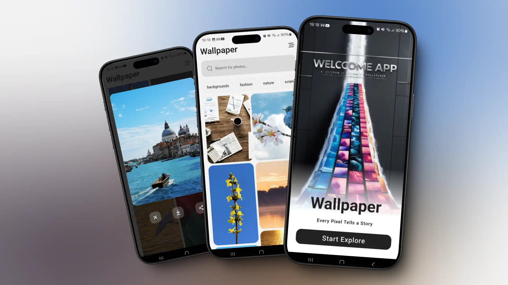
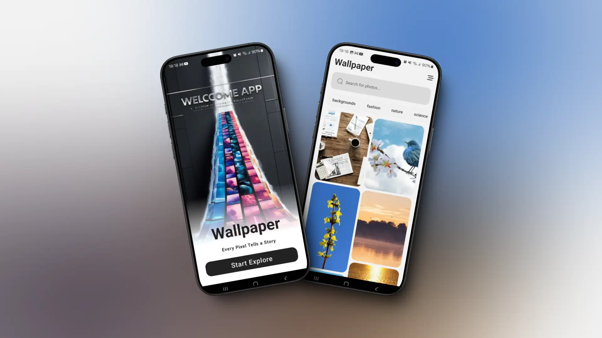

# About the app 

This is a Wallpaper App built by `Diego Tech` by using:

- React Native
- Expo
- TypeScript

<br />





<br />

## Libraries I used for this App 🚀

- React Native Reanimated
- Expo Vector Icons
- Expo Linear Gradient
- Axios
- React Native Dot Env
- FlashList
- Expo Image
- Lodash
- React Native Bottom Sheet
- Expo Blur
- Expo File System
- Expo Sharing
- React Native Toast Message
- Expo Doctor

### One Message for EveryOne 🔥

> [!TIP]
> ```shell
> Aguante Argentina!!!
> Aguante Messi!!!
> ```